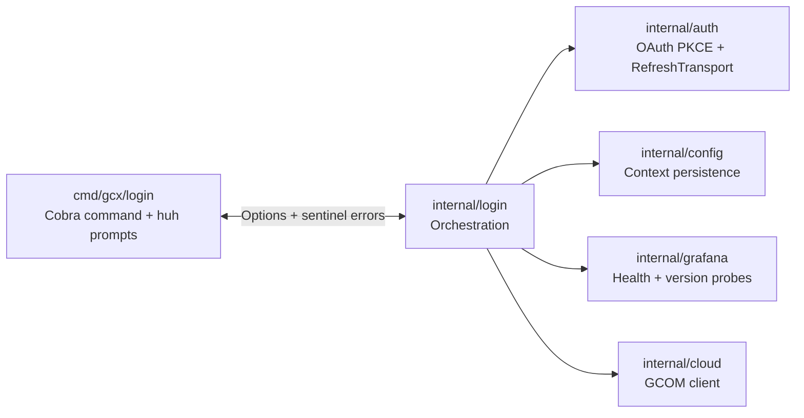
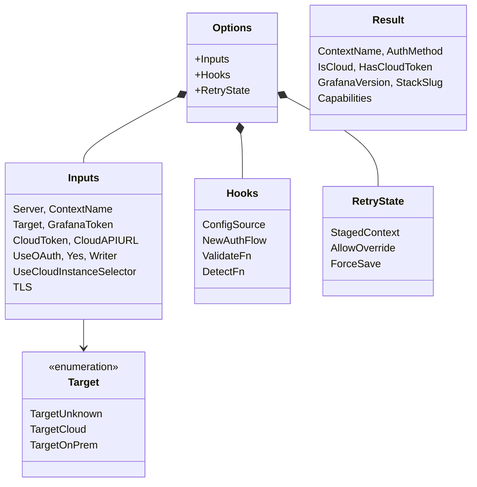
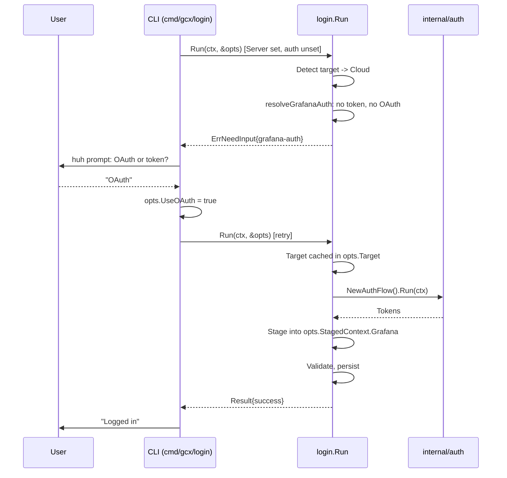

# Login System

## Overview

`internal/login/` orchestrates the `gcx login` command. It sits between the
CLI (`cmd/gcx/login/`), the low-level authentication mechanics in
`internal/auth/`, configuration persistence in `internal/config/`, Grafana
health and version probing in `internal/grafana/`, and Grafana Cloud stack
discovery in `internal/cloud/`.

The package is UI-free. It never prompts, never prints, and never reads from
stdin. Interactive input flows through the CLI layer via the sentinel-retry
protocol documented below. The separation lets other callers drive the same
orchestration headlessly (for example, from automation or future embedding
points) without pulling in TUI dependencies.



---

## Data Model



`Options` is the single parameter to `Run()` and is taken by pointer so that
mutations performed by the CLI sentinel-retry loop (and by `Run()` itself,
notably the resolved `Target`) survive across iterations. `Options` embeds
three semantic groupings:

- `Inputs` holds user-supplied values sourced from flags, environment
  variables, and interactive answers.
- `Hooks` holds injection seams for tests and alternative drivers:
  `ConfigSource` (where to read and write the config file), `NewAuthFlow`
  (OAuth factory), `ValidateFn` (connectivity validation override), and
  `DetectFn` (target detection override). Each hook has a safe default when
  left nil.
- `RetryState` carries cross-invocation plumbing. `StagedContext` is a
  partially-populated `config.Context` whose `Grafana` and `Cloud` sub-fields
  are populated step-by-step so that subsequent retries skip work (notably
  re-running the OAuth flow). `AllowOverride` and `ForceSave` are set by the
  CLI after the user confirms clarification prompts — see the Context
  Resolution and Persistence and Validation sections for their effects.

Exact field definitions live in `internal/login/login.go` (structs and
sentinels are colocated with `Run` — the package has no separate
`types.go`). `Target` is declared at the top of the same file.

---

## Run() Pipeline

```mermaid
flowchart TD
    Start([Run entry]) --> Server{Server set?}
    Server -->|no| SrvSentinel[Return ErrNeedInput&#123;server&#125;]
    Server -->|yes| Scheme[Normalize scheme:<br/>default https]
    Scheme --> Detect[Detect target]
    Detect --> TgtKnown{Target resolved?}
    TgtKnown -->|no, interactive| TgtSentinel[Return ErrNeedClarification&#123;target&#125;]
    TgtKnown -->|no, --yes or agent| TgtOnPrem[Force TargetOnPrem]
    TgtKnown -->|yes| Auth[Resolve Grafana auth]
    TgtOnPrem --> Auth
    Auth --> AuthHave{Token, mTLS, or OAuth?}
    AuthHave -->|no| AuthSentinel[Return ErrNeedInput&#123;grafana-auth&#125;]
    AuthHave -->|yes| Ctx[Derive context name]
    Ctx --> Cloud[Resolve cloud auth]
    Cloud --> CloudNeeded{Cloud target<br/>+ no token?}
    CloudNeeded -->|yes, interactive| CloudSentinel[Return ErrNeedInput&#123;cloud-token&#125;<br/>Optional=true]
    CloudNeeded -->|no or skip| Validate[Validation pipeline]
    Validate --> ValOK{Passed?}
    ValOK -->|no, interactive| ForceSentinel[Return ErrNeedClarification&#123;save-unvalidated&#125;]
    ValOK -->|no, --yes or agent| Fail([Return error])
    ValOK -->|yes| Persist[Merge or create context,<br/>write to config]
    Persist --> Mismatch{Existing server<br/>mismatches?}
    Mismatch -->|yes, no override| OverSentinel[Return ErrNeedClarification&#123;allow-override&#125;]
    Mismatch -->|no| Result([Return Result])
```



The pipeline reads top-to-bottom in `Run()` (login.go:180). Each step returns
early on failure; sentinel branches unwind to the CLI for interactive
resolution and re-entry:

1. **Server check** (login.go:184). Missing server → `ErrNeedInput{server}`.
2. **Scheme normalization** (login.go:191). A bare hostname is rewritten to
   `https://<host>`. Callers that need `http://` must pass it explicitly.
3. **Target detection** (login.go:194). Delegates to `detectTarget`; see the
   next section. An unresolved target with `--yes` or agent mode falls
   through to `TargetOnPrem`; otherwise it yields
   `ErrNeedClarification{target}`.
4. **Grafana auth resolution** (`resolveGrafanaAuth`, login.go:223). Picks
   between explicit token and OAuth based on input flags. Missing auth
   yields `ErrNeedInput{grafana-auth}`.
5. **Context-name derivation** (login.go:234). Falls back to
   `config.ContextNameFromServerURL`, which returns the stack slug for known
   Grafana Cloud URLs and a hyphenated hostname otherwise.
6. **Cloud auth resolution** (`resolveCloudAuth`, login.go:383). Only runs
   for `TargetCloud`; a missing token yields an optional
   `ErrNeedInput{cloud-token}` that the CLI may skip.
7. **Validation** (login.go:245). Delegated to `Validate` (see below); the
   CLI offers an escape hatch for interactive users when validation fails.
8. **Persistence** (`persistContext`, login.go:414). Writes only after all
   checks pass; may raise `ErrNeedClarification{allow-override}` when the
   context already targets a different server.

---

## Sentinel-Retry Mechanism

The login package and the CLI communicate via typed sentinel errors instead
of direct I/O. When `Run()` needs a value it cannot obtain on its own — a
missing token, an ambiguous target, a server URL the user never supplied —
it returns a sentinel error instead of prompting. The CLI's `askForInput`
and `askForClarification` loops recognize the sentinel, open a `huh` prompt
for the named field, mutate `*Options` with the answer, and re-enter
`Run()`. The cycle repeats until `Run()` returns a non-sentinel result
(success or hard failure).

Two sentinel types exist:

- `ErrNeedInput{Fields, Optional, Hint}` (login.go:134) signals a missing
  value the caller must supply. `Fields` lists one or more missing field
  names; `Optional=true` lets the CLI offer "skip" alongside the input
  prompt (used for `cloud-token`).
- `ErrNeedClarification{Field, Question, Choices}` (login.go:148) signals
  an ambiguous state the caller must resolve. The CLI presents `Choices`
  as a select and writes the answer back into `*Options` or `RetryState`.

Because `Options` is a pointer, values written by the CLI (either into
`Inputs` fields or into `RetryState`) survive across retries. The partial
`StagedContext` inside `RetryState` additionally caches resolved auth state
so the next iteration does not re-run an OAuth flow that already succeeded.
The resolved `Target` is propagated back into `opts.Target` at login.go:224
so target detection also runs only once.



The OAuth sequence above is one illustrative path; the same mechanism
drives every sentinel-driven step. Sentinel fields currently in use:

| Sentinel | Field / Fields | Source |
|---|---|---|
| `ErrNeedInput` | `server` | login.go:183 |
| `ErrNeedInput` | `grafana-auth` | login.go:349 |
| `ErrNeedInput` | `cloud-token` (optional) | login.go:390 |
| `ErrNeedClarification` | `target` | login.go:213 |
| `ErrNeedClarification` | `save-unvalidated` | login.go:260 |
| `ErrNeedClarification` | `allow-override` | login.go:425 |

---

## Target Detection

`DetectTarget` (detect.go:18) runs three tiers, in order, and stops at the
first match:

1. **Known-cloud suffix table.** `config.StackSlugFromServerURL`
   (`internal/config/types.go:189`) matches the server hostname against
   `grafanaCloudStackSuffixes` (`.grafana.net`, `.grafana-dev.net`,
   `.grafana-ops.net`). A match yields `TargetCloud` with no network call.
2. **Localhost heuristic.** `isLocalHostname` (detect.go:37) returns true
   for loopback addresses (`localhost`, `127.0.0.1`, `::1`,
   `*.localhost`), RFC 1918 IPv4 ranges (`10/8`, `172.16/12`,
   `192.168/16`), and IPv6 ULA (`fd00::/8`). Matches yield `TargetOnPrem`
   with no network call. Intranet suffixes like `.local` or `.corp` are
   not treated as local.
3. **HTTP probe.** `probeTarget` (detect.go:78) fetches
   `/api/frontend/settings` via `grafana.FetchAnonymousSettings` with a
   three-second timeout. A valid response whose `buildInfo.grafanaUrl` host
   matches `config.IsGrafanaCloudHost` (which additionally covers the
   `.grafana.com`, `.grafana-dev.com`, `.grafana-ops.com` root domains) →
   `TargetCloud`. A valid response with no Cloud marker → `TargetOnPrem`.
   Any error, timeout, or unparseable URL → `TargetUnknown`.

Explicit overrides short-circuit detection: passing `--cloud` forces
`TargetCloud` before `Run()` ever invokes detection (set at
`cmd/gcx/login/command.go:187`). When detection returns `TargetUnknown`,
`--yes` or agent mode (`agent.IsAgentMode`) defaults the target to
`TargetOnPrem` (login.go:210); interactive sessions receive the
`target` clarification sentinel instead.

---

## Validation Pipeline

`Validate` (validate.go:111) runs four checks in order and fails fast. The
first failure surfaces as a validation error; no partial state is written
to disk.

1. **Grafana health and version.** `grafana.GetVersion` hits `/api/health`;
   network failure surfaces here.
2. **K8s API availability.** `discovery.NewDefaultRegistry(ctx, restCfg)`
   probes `/apis` using the same REST config the command will use later.
3. **Version floor.** The parsed semver must satisfy `Major() >= 12`. An
   unparseable or suppressed version string (Grafana Cloud sometimes hides
   it from anonymous callers) bypasses the check rather than failing; the
   returned version reads `"unknown"` in that case (validate.go:62-84).
4. **GCOM reachability.** Only when `Target == TargetCloud`, a cloud token
   is supplied, and `resolveStackSlug` produced a non-empty slug.
   `cloud.GCOMClient.GetStack` confirms the slug is reachable with the
   supplied token.

Tests inject each step via the `grafanaClient`, `discovery`, and
`gcomClient` fields on the `validator` struct (validate.go:32). The
higher-level `Hooks.ValidateFn` override replaces the entire pipeline.
`Run()` bypasses validation altogether when `RetryState.ForceSave` is set,
which the CLI enables after the user answers the `save-unvalidated`
clarification affirmatively.

---

## Context Resolution and Persistence

`persistContext` (login.go:400) loads the current config (tolerating
`os.ErrNotExist`), inserts or updates the context, and writes the file
back. Two paths diverge based on whether the context already exists:

**New-context path.** `cfg.SetContext(name, current=true, tempCtx)` adds
the fresh `Context` with all resolved fields and marks it current.
`resolveGrafanaAuth` defaults `GrafanaConfig.OrgID` to 1 for fresh on-prem
logins (login.go:356) so the later
`GrafanaConfig.validateNamespace` does not attempt `/bootdata` stack
discovery against an OSS instance that cannot answer.

**Re-auth path.** `mergeAuthIntoExisting` (login.go:452) copies only the
auth-bearing fields — `Server`, `AuthMethod`, `APIToken`, `OAuthToken`,
`OAuthRefreshToken`, `OAuthTokenExpiresAt`, `OAuthRefreshExpiresAt`,
`ProxyEndpoint`, and the `Cloud.Token` / `Cloud.APIUrl` pair — onto the
existing context. User-set values such as `OrgID=42`, custom datasource
defaults, or provider-specific tokens survive untouched.

**Server-mismatch guard.** When the existing context targets a different
server than the incoming one and neither `opts.Yes` nor
`RetryState.AllowOverride` is set, `persistContext` raises
`ErrNeedClarification{Field: "allow-override"}`. The CLI's confirmation
prompt sets `AllowOverride=true` on retry so the second call through
reaches the merge.

For the mechanics of how tokens subsequently reach HTTP clients — including
the `ResolveTokenPersistenceSource` selection used by OAuth token rotation
— see
[Configuration and context system](config-system.md#from-config-to-rest-client).

---

## File Pointers

```
internal/login/
  login.go     Run() entry; Options, Inputs, Hooks, RetryState, Target,
               Result, ErrNeedInput, ErrNeedClarification, AuthFlow;
               resolveGrafanaAuth, resolveCloudAuth, persistContext,
               mergeAuthIntoExisting
  detect.go    DetectTarget (suffix-table → localhost → HTTP probe),
               isLocalHostname, probeTarget
  validate.go  Validate entry point; validator struct; realGrafanaClient;
               resolveStackSlug
```

There is no `types.go` or `errors.go` — all public types, sentinels, and
helper structs live beside `Run()` in `login.go`.

---

## See Also

- [Authentication subsystem](auth-system.md) — OAuth PKCE flow, token
  lifecycle, `RefreshTransport`.
- [Configuration and context system](config-system.md) — how contexts are
  stored, merged, and turned into REST clients.
- [Login reference (user-facing)](../reference/login.md) — how to log in
  and troubleshoot common errors.
- [ADR 001: Login + config consolidation](../adrs/login-consolidation/001-login-config-consolidation.md)
  — historical rationale.
